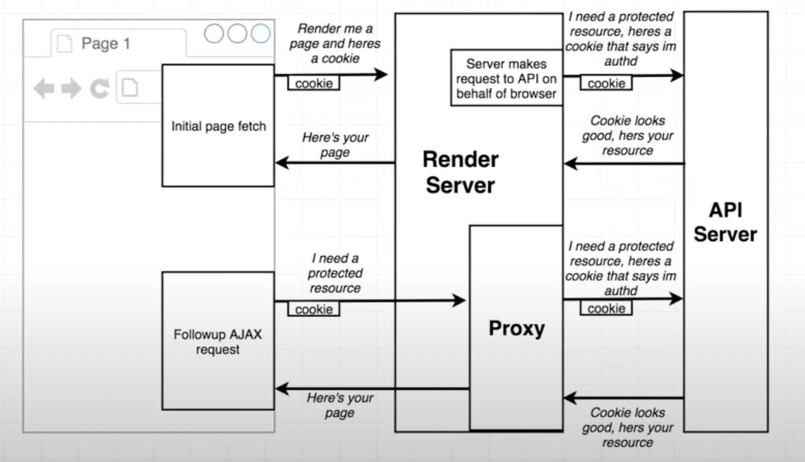
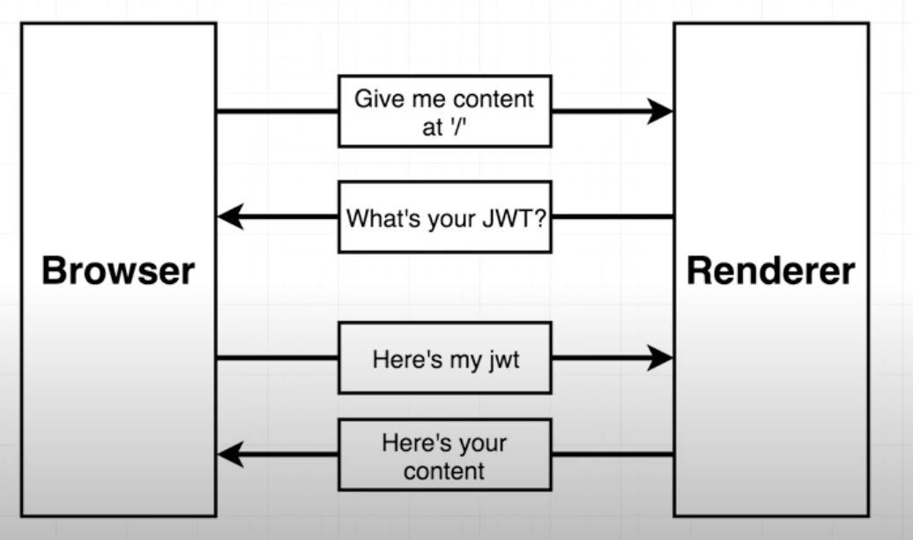

## High level overview
- App rendered on the server into  some div in the template // skeleton
- Rendered app sent to the users browser
- Browser renders HTML file on the screen, then loads client bundle
- Clinet bundle boots up // breathes in life
- We manually render the React app a second time into the 'same' div 
- React renders our app on the client side, and compares the new HTML to what already exists in the document
- React 'takes over' the existing render app, binds event handlers, etc

## With Router

- Browser requests '/users/'
- Express handler of 'app.ger('*')' responds
- Express sends down index.html
- Express sends down bundle.js
- React boots up, React Router boots up
- BrowserRouter looks at URL in address bar, renders some router
  
server --> static router

client --> browser router

## 4 Big Redux challenges

- Redux needs different configuration on browser vs server
- Aspects of authentication needs to be handled on server normally this is only on browser!
- Need some way to detect when all initial data load action creators are completed on server
- need state rehydration on the browser

## Data being fetched and renders in browser

- Entire app rendered
- -----------------------> response sent back to the browser before any data is being fetched at the server
- UserList 'componentDidMount'
- Call 'fetchUsers'
- Make API request (and wait for response)
- get list of users
- list of users caught by reducer
- UserList component renders, shows users

## call api's on the server solution

- figure out what components would have rendered (based on URL)
- call a 'loadData' method attached to each of those components (wait for response)
- somehow detect all requests are complete
- render the app with the collected data
- send result to browser

## What's happening now on the client side

- Server Redux fetched data | reduxState = { users: [ { name: 'bill'}, ...]}
- Page rendered on server
- Page HTML send to browser
- Client bundle.js sent to browser
- Bundle creates its client side redux store
- Page rendered with store from client side redux | reduxState = {users:[]}

`Look for xss attack, insted of JSON.stringify use serialize intead`

 <pre> 
 --------  Browser trying to access    -------- Browser trying ot access
 | API  |  api.ourapp.com from         |RENDER| www.ourapp.com from api.ourapp.com
 |SERVER|  api.ourapp.com, so          |SERVER| ,so browser does not sends cookies
 --------  browser sends cookies       --------

Setup a Proxy on renderer server

                    --------                       --------
 hey i went through |RENDER|  hey i went through   | API  |
 the auth process ->|SERVER|  the auth process ->  |SERVER|
                    --------                       --------

                           --------                             --------
 Great here's a cookie     |RENDER|  Great, here's a cookie     | API  |
 with unique code that <-  |SERVER|  with unique code that <-   |SERVER|
 identifies you, attach it --------  identifies you, attach it  --------
 to all followup requests            to all followup requests
</pre>
 

if using `JWT` token instead of cookies then we can't send the html directly we have to do some follow up requests

 

 ## API
 - / API Documentation
 - /users Return a list of 'users'
 - /admins Return a list of 'admins' if user is logged in
 - /auth/google Start the auth process
 - /current_user Return information about the currently logged in user
 - /logout Log out user of the app

<pre>
context  ==>  staticRouter ==> context
                    |
                NotFoundpage
</pre>

## Normal React App

- User visits /users
- we render 'Helmet' tag
- Helmet takes new tags and manually tinkers with HTML in head tag

## SSR React App

- User visits /users
- We render 'Helmet' tag
- Helmet loads up all the meta tag we want to show
- We dump Helmet's tags directly into HTML template